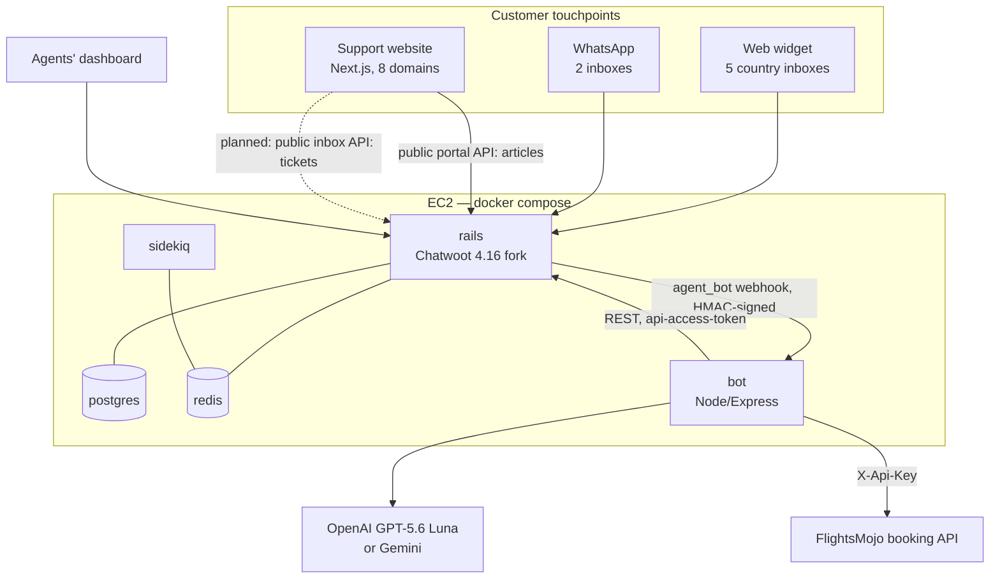
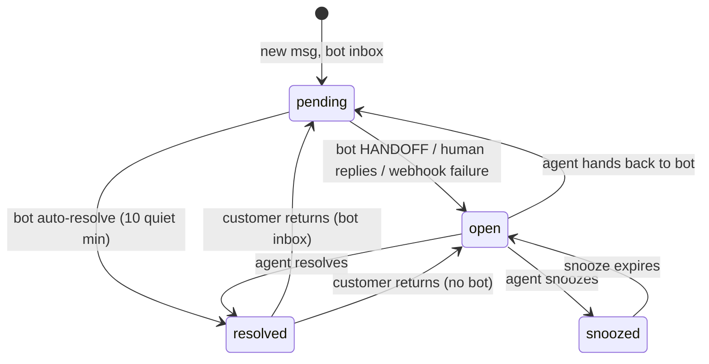

# FlightsMojo support platform — system map

> **Why this file exists.** Three repos make up the support platform and the
> interesting logic is spread across all of them. This is the orientation map:
> what lives where, which contracts join the pieces, and the non-obvious
> behaviours that cost time to rediscover. Read this before grepping.
>
> **Accuracy notes.** Verified against the code in August 2026 at release
> **4.16.0**; §1, §9 and §13 updated 22 Sep 2026 for the **4.18.0** merge.
> Line numbers are signposts, not guarantees — they drift with upstream
> merges and with our own edits (§9 changes shift several of the numbers in
> §10). Trust the file + method name; re-check the line.

---

## 1. The three repos

| Repo | Path | Contains | Ships as |
|---|---|---|---|
| **Hub** | `~/Work/flightsmojo/flightsmojo-chatwoot` | `docker-compose.yml`, the AI bot (`bot/`), provisioning scripts, these docs | Only `bot/` becomes an image (built on the server) |
| **Fork** | `~/Work/flightsmojo/chatwoot-fork` | Chatwoot fork, branch `flightsmojo` — **4.16.0 in prod**, 4.18.0 + our features ready on `feat/fm-booking-badge-inbox-counts` (§9) | CI → `ghcr.io/mishraadityan09/chatwoot:v4.16.0-fm1` (prod) / `v4.18.0-fm2` (next) |
| **Support site** | `~/Work/flightsmojo/flightsmojo-support` | Next.js 16 help/ticket website, 8 country domains | `next build` → Windows IIS via iisnode |

Production stack (compose): `rails`, `sidekiq`, `postgres` (pgvector), `redis`,
`bot`. Rails is published on `127.0.0.1:3001`, the bot on `127.0.0.1:3002` —
**both localhost-only**; nginx terminates TLS in front.



---

## 2. The one mental model that explains everything: conversation status

Chatwoot conversations are a state machine, and **ownership** is what each
state encodes. Nearly every behaviour in this platform keys off it.

| Status | Owner | Meaning |
|---|---|---|
| `pending` | 🤖 the bot | Exists only because the inbox has an active agent bot. Agents ignore these. |
| `open` | 🧑 humans | In the agents' queue. Auto-assignment only ever touches these. |
| `resolved` | nobody | Done. A new customer message reopens it. |
| `snoozed` | humans, later | Reopens as `open`. |

**Transitions worth memorising**

- New conversation on a bot-enabled inbox → created `pending`.
- Bot decides a human is needed → `PATCH toggle_status` to `open`.
- Human replies to a `pending` chat → our bot detects it and flips to `open`.
- Bot webhook delivery fails → **Chatwoot itself** flips `pending` → `open`
  and writes an activity message (`lib/webhooks/trigger.rb`,
  `update_conversation_status`), unless
  `account.keep_pending_on_bot_failure`. Bot downtime fails toward humans.
- Resolved conversation receives a new incoming message
  (`app/models/message.rb:403` `reopen_conversation` → `:424`
  `reopen_resolved_conversation`): if `inbox.active_bot?` → **`pending`**
  (bot greets them first); if API channel → `open`; otherwise default reopen.
  *This is why bot auto-resolve is never a dead end.*
- Agents can push a chat back to the bot by setting `pending` again.



---

## 3. Agent-bot pipeline (Chatwoot → our bot)

**Path:** `app/listeners/agent_bot_listener.rb` → `AgentBots::WebhookJob`
(`app/jobs/agent_bots/webhook_job.rb`) → `Webhooks::Trigger`
(`lib/webhooks/trigger.rb`) → `POST` to `agent_bot.outgoing_url`.

Events dispatched to bots: `message_created`, `message_updated`,
`conversation_created/opened/resolved/status_changed/updated`,
`webwidget_triggered`.

**Critical facts**

- **The bot receives messages regardless of conversation status.** The
  listener does not filter by status — filtering is the *bot's* job. Also
  `message.webhook_sendable?` (`app/models/concerns/message_filter_helpers.rb`)
  is `incoming? || outgoing? || template?`, so **private notes reach the bot
  too** — always check `event.private`.
- **Sender type is the takeover signal:** `user.rb:158` → `type: 'user'`
  (dashboard human), `agent_bot.rb:58` → `type: 'agent_bot'` (us),
  `contact.rb:167` → `type: 'contact'`.
- **Payload shapes differ by event.** `message_created` nests the conversation
  under `conversation:` (`message.rb:180` `webhook_data`). Conversation-level
  events put it at the **top level** (`conversation.webhook_data` merged with
  `event:`), where `id` is the **display_id** and `status` sits alongside.
- **Deliveries are HMAC-signed** (see §7).
- **Retries only on 429/500** from the bot
  (`Webhooks::Trigger::RETRYABLE_AGENT_BOT_STATUSES`), 3 attempts, 3s apart.
  Timeouts/network errors are *not* retried — they trigger the pending→open
  fallback instead. Webhook timeout defaults to **5 s**
  (`GlobalConfig WEBHOOK_TIMEOUT`). Since our bot ACKs 200 immediately,
  duplicate deliveries are effectively impossible; `X-Chatwoot-Delivery`
  is a ready-made dedupe key if that ever changes.

---

## 4. Auto-assignment (round robin + our sticky layer)

**Files:** `app/services/auto_assignment/assignment_service.rb` (core),
`agent_assignment_service.rb`, `round_robin_selector.rb`,
`inbox_round_robin_service.rb`, `rate_limiter.rb`;
jobs `app/jobs/auto_assignment/assignment_job.rb` (Redis in-flight gate, one
per inbox, 5-min TTL) and `periodic_assignment_job.rb`.
Policy model: `app/models/assignment_policy.rb`
(`DEFAULT_EXCLUDE_OLDER_THAN_HOURS = 168`, i.e. 7 days).

**How a conversation gets an agent**

1. `perform_bulk_assignment` runs only if
   `inbox.auto_assignment_v2_enabled?` **and** `inbox.enable_auto_assignment?`.
2. Candidates: `inbox.conversations.unassigned.open`, minus stale ones
   (`last_activity_at` older than the policy threshold), ordered by
   `longest_waiting` or `created_at`.
3. `assignable?` = **`status == 'open'` && `assignee_id.nil?`**.
4. Agent chosen from `inbox.available_agents` (online only), filtered by team
   eligibility and per-agent rate limit, then round robin.
5. `claim_and_assign` locks the row `FOR UPDATE SKIP LOCKED` so overlapping
   runs can't double-assign.

**Consequences worth knowing**

- **A reopened conversation keeps its old assignee.** Nothing clears
  `assignee_id` on resolve/reopen, and step 3 skips assigned conversations.
  "Sticky on reopen" needed **no code** — it is already the behaviour.
- **`pending` (bot) conversations are never auto-assigned** — only `open`.
- The activity message "Assigned to X by Default Policy" comes from
  `app/models/concerns/assignee_activity_message_handler.rb`.

---

## 5. Auto-resolve — two independent mechanisms

| | Chatwoot built-in | Our bot's |
|---|---|---|
| Scope | **`open` only** (`conversation.rb:93-101`, `resolvable_all` / `resolvable_not_waiting` are `open.where(...)`) | **`pending` only** |
| Config | Account settings: `auto_resolve_after` (minutes, min 10), `auto_resolve_message`, `auto_resolve_label`, `auto_resolve_ignore_waiting` (`account.rb:52`, scope `with_auto_resolve` at `:109`) | `AUTO_RESOLVE_MINUTES`, default **10**, in `bot/server.js` |
| Runs via | `Account::ConversationsResolutionSchedulerJob` → `Conversations::ResolutionJob` | In-RAM `setTimeout` per conversation |

They do not overlap — that gap is exactly why the bot has its own. Enabling
the built-in one from the dashboard covers agents' forgotten `open` tickets.

---

## 6. Public APIs (no agent token) — used by the support website

### Help Centre / portal (read)
Routes: `config/routes.rb:614-625`. Controllers under
`app/controllers/public/api/v1/portals/`. JSON shape:
`app/views/public/api/v1/models/_article.json.jbuilder`.

- List: `GET /hc/{portal}/{locale}/articles.json` → `{ payload: [...], meta: { articles_count } }`
- One: `GET /hc/{portal}/articles/{slug}.json` → the article object **at top level**
- Raw markdown: `.../{slug}.md` · Search: `/hc/{portal}/{locale}/search`
- Categories: `/hc/{portal}/{locale}/categories`

Article fields: `id, slug, title, content, description, status, position,
category{id,slug,locale}, portal{...}, views, last_updated_at, link, author`.

**Gotchas**
- `content` is **Markdown**, not HTML (Zendesk sent HTML). The HTML view
  renders it server-side; the JSON does not.
- `link` is **relative** (`hc/flightsmojo/articles/<slug>`) — prefix the host.
- `ensure_custom_domain_request` (`app/controllers/public_controller.rb:9`)
  guards index/show: the request must hit the Chatwoot domain *or* a host
  registered as a portal `custom_domain`. Calling `chat.flightsmojo.com`
  directly is fine.
- Live inventory (Aug 2026): **12 articles**, portal slug `flightsmojo`,
  locale `en`. Same 12 as the old Zendesk help centre.

### Inbox (write) — for creating tickets from our own frontend
Controllers: `app/controllers/public/api/v1/inboxes/{contacts,conversations,messages}_controller.rb`.
Requires an **API-channel inbox**; auth is just the `inbox_identifier` in the URL.

Flow: `POST .../contacts` (permits `identifier, identifier_hash, email, name,
avatar_url, phone_number, custom_attributes{}`) → `POST .../contacts/{source_id}/conversations`
(permits **`custom_attributes{}` only**) → `POST .../conversations/{id}/messages`.

**Labels cannot be set through the public API** — use `custom_attributes` plus
a dashboard automation rule, or an agent-token call server-side.

---

## 7. Security boundaries & trust

**Webhook signing (fork → bot).** Every agent-bot delivery carries:

```
X-Chatwoot-Delivery : <uuid>
X-Chatwoot-Timestamp: <unix seconds>
X-Chatwoot-Signature: sha256=HMAC_SHA256(agent_bots.secret, "{timestamp}.{raw body}")
```

Built in `Webhooks::Trigger#request_headers`. The secret is auto-generated
(`app/models/concerns/webhook_secretable.rb`, `has_secure_token :secret`,
encrypted at rest when configured) and **is not shown in the Super Admin UI** —
read it with
`docker compose exec rails bundle exec rails runner 'puts AgentBot.find(1).secret'`.
Our bot verifies it when `CHATWOOT_BOT_HMAC_SECRET` is set (see §8).

**Untrusted input — the important one.** The *public widget API* permits
`custom_attributes: {}` wholesale on contact **and** conversation
(`app/controllers/api/v1/widget/conversations_controller.rb:98`,
`widget/contacts_controller.rb:88`). The website token is public, so **any
visitor can pre-set arbitrary conversation custom attributes**, including
`booking_id`. Never treat a custom attribute as bot-authored.

By contrast, **contact `email` is validated** (`contact.rb:51-52`,
`Devise.email_regexp`, so no whitespace/sentences) and stored downcased
(`:225`). Contact **`name` has no format validation** — it reaches webhooks
raw, which is why the bot sanitises it before the system prompt.

---

## 8. The bot — `bot/server.js` (hub repo)

Single-file Express app, ~700 lines, no framework beyond Express. Deployed by
`docker compose build bot && docker compose up -d bot` (bot image only; Rails
untouched). All state is **in RAM** — a restart forgets histories, mutes and
auto-resolve timers, by design.

| Concern | Implementation |
|---|---|
| Webhook auth | `isFromChatwoot()` — constant-time HMAC compare + 5-min timestamp window. **Dormant unless `CHATWOOT_BOT_HMAC_SECRET` is set**; warns at boot. Raw body captured via `express.json({ verify })`. |
| Who may be answered | `message_type === 'incoming'` && `conversation.status === 'pending'` && not muted |
| Human takeover | outgoing + `!private` + `sender.type === 'user'` → `muteBot`, clear history, cancel auto-resolve, flip `pending`→`open` |
| Takeover race | mute is re-checked **after** the LLM call, before posting |
| Mute list | 5-minute TTL, covers async status propagation |
| Provider | `BOT_PROVIDER=openai` (GPT-5.6 Luna, `/v1/responses`) or `gemini`; identical contract, tool loop max 4 rounds |
| Booking tool | `get_booking_status`, requires **email + (PNR or booking id)**; enforced in schema, prompt, and a hard check |
| Payment safety | `sanitizePaymentStates()` rewrites `Authorized/Captured` → `Received` and converts any payment problem into a forced handoff — deterministic, not prompt-dependent |
| Booking id persistence | `stampBookingId()` writes the conversation custom attribute **only after a successful lookup** (`lookupSucceeded`) |
| Input hygiene | inbound `booking_id` must be `^\d{1,10}$`; emails must match a strict no-space regex; name reduced to letters/`'`/`-`, capped 30 chars |
| Auto-resolve | 10 quiet minutes (`AUTO_RESOLVE_MINUTES`, `0` disables) → fixed goodbye message → `toggle_status: resolved`. Cancelled by customer message, human reply, or status leaving `pending` |
| Handoff | `HANDOFF` token from the LLM, or `WANTS_HUMAN_RE` regex **before** any model call |
| Knowledge | `bot/prompt.js` + `faq.md` + `helpcenter.md` (generated from `scripts/helpcenter_import.rb`), per-inbox market via `INBOX_SITES` |

**Hard-won deployment lessons already encoded in comments**

- Chatwoot API headers must use **hyphens** (`api-access-token`) — nginx drops
  underscored headers, which 401s every reply in prod while working locally.
- `CHATWOOT_BASE_URL` must be the **public HTTPS URL** in production;
  `FORCE_SSL` 301s plain-HTTP calls and the bot then speaks TLS to a plain
  port (`ERR_SSL_WRONG_VERSION_NUMBER`).
- The bot token may post messages and change status but **may not read message
  history** — hence the in-RAM history.

---

## 9. Our fork modifications

**On branch `flightsmojo` (what prod runs, `v4.16.0-fm1`):** branding only
(logos, favicons, installation defaults, no widget footer) +
`.github/workflows/flightsmojo_image.yml` (CE build → GHCR). **The CI strips
`enterprise/` before building** (`rm -rf enterprise spec/enterprise`), so no
enterprise override is loaded in production — `ChatwootApp.enterprise?` keys
off that directory existing; `CW_EDITION=ce` is only a telemetry label.

**Committed on `feat/fm-booking-badge-inbox-counts` (22 Sep 2026, not yet
pushed):** upstream **v4.18.0** merged (clean; 25 migrations since 4.16.0), plus:

| Commit | Files | Change |
|---|---|---|
| `feat(dashboard)` | `components/widgets/conversation/ConversationHeader.vue`, `i18n/locale/en/conversation.json` | `BK-<id>` click-to-copy chip beside the contact name, from `chat.custom_attributes.booking_id`; i18n keys `CONVERSATION.HEADER.BOOKING_ID_*`; `max-w-40 truncate` |
| | `components-next/sidebar/Sidebar.vue` | Channels badges show **open ticket counts** and the list **sorts by the same number**; watcher on the inbox-id list dispatches `inboxOpenCounts/fetch` |
| | `store/modules/inboxOpenCounts.js` *(new)*, `store/mutation-types.js`, `store/index.js` | Per-inbox open counts via `ConversationApi.meta({ inboxId, status: 'open' })` (the existing helper in `api/inbox/conversation.js`); trailing-edge 5 s throttle with a round counter so a slow round can't overwrite a fresh one; a failed request **keeps the last known count**; `clear` action |
| | `helper/actionCable.js`, `helper/ReconnectService.js` | fetch on `onConversationCreated`, `onStatusChange` and after `revalidateCaches` on reconnect |
| `feat(assignment)` | `services/auto_assignment/{assignment_service,round_robin_selector,inbox_round_robin_service}.rb`, `enterprise/.../{assignment_service,balanced_selector}.rb` | **Sticky assignment** (below) |
| `fix(webhooks)` | `lib/webhooks/trigger.rb` | 4.18 assigns a pending conversation to the inbox bot (`ai_assignee`); the bot-failure fallback (`update_conversation_status`) opened the conversation but left that in place, so `unassigned` excluded it and no agent ever got it. We clear `ai_assignee` first. Upstream `develop` still has the bug. |
| `ci` | `.github/workflows/flightsmojo_image.yml` | image tag `v4.18.0-fm2` |

**Sticky assignment (final design).** `sticky_agent_id(conversation)` in
`AssignmentService` returns the agent who most recently sent a **public
outgoing message as a `User`** to this customer within
`STICKY_ASSIGNMENT_LOOKBACK = 90.days` — measured from the reply, across all
the customer's conversations, with contacts linked across channels by **phone
number** (email can't link: contacts are unique per email per account). It is
passed as `preferred_user_id:` into the selector (`RoundRobinSelector` →
`InboxRoundRobinService#available_agent(preferred_agent_id:)`, and the
enterprise `BalancedSelector`), i.e. **after** every eligibility filter
(online, team, rate limit, and capacity in EE), and the chosen agent is
`pop_push`ed to the back of the Redis queue like any round-robin pick. Bot
messages, private notes and never-answered assignments don't create a
relationship. Kill switch `DISABLE_STICKY_ASSIGNMENT` is parsed with
`ActiveModel::Type::Boolean`. Only the assignment_v2 bulk path has it (the v1
`AgentAssignmentService` doesn't) — verify the account flag.

### Review findings on this branch (Aug 2026, `/code-review` max effort)

**Status 22 Sep 2026** — a second review confirmed the same list, nothing new.
Fixed in the commits above: **1, 2, 3, 4, 5, 7, 8, 10, 11, 12, 14 (except the
unmount timer), 16, 17, 18**, plus the `getInboxOpenCount`/`assignee_type`
and `BK-` chip cleanups; 9 largely (one `available_agents` call, no SCAN
precheck; two small queries per conversation remain). **Still open: 6**
(verify `assignment_v2` on the account), **13** (per-inbox `/meta` fan-out;
fine at our size), **15** (sidebar re-render on every poll). The original
list follows for reference.

*Sticky assignment (`assignment_service.rb`)*

1. **Enterprise gates are bypassed.** The file ends with
   `prepend_mod_with`, and `enterprise/.../assignment_service.rb` overrides
   **`find_available_agent`** to add `filter_agents_by_capacity` and the
   `BalancedSelector`. Because `find_sticky_agent` runs *first* and returns
   early, an agent already over their `AgentCapacityPolicy` limit still gets
   every returning customer. The in-code comment claiming sticky applies "the
   exact gates round robin applies" is false on EE builds. Also breaks repo
   `CLAUDE.md`: *"When you add or modify core functionality, always check for
   corresponding files in `enterprise/` and keep behavior compatible."*
2. **Round-robin queue is never rotated.** `InboxRoundRobinService`
   de-prioritises an agent inside `select_agent` via `pop_push_to_queue`
   (lrem + lpush). Sticky returns `member.user` directly, so the sticky agent
   stays at the queue tail and **wins the next round-robin pick too** —
   double-loading them until the 5-per-5-min rate limiter trips.
3. **The email branch is dead code.** `contacts` has
   `uniq_email_per_account_contact` UNIQUE on `(email, account_id)`, so
   `where(email: …)` can only ever return the same contact. The advertised
   cross-channel match therefore works via **phone number only** — the
   email-inbox case it was written for never fires.
4. **Kill switch won't parse.** `ENV['DISABLE_STICKY_ASSIGNMENT'] == 'true'`
   is the only `== 'true'` in the Ruby tree; the house idiom is
   `ActiveModel::Type::Boolean.new.cast(ENV.fetch(...))` (see
   `assignment_job.rb:53` in the same feature). `=1`, `TRUE`, or a trailing
   space silently leaves sticky **on**.
5. **The 90-day window never expires.** The filter is applied to the *anchor's*
   `last_activity_at`, and `conversations.last_activity_at` defaults to
   `CURRENT_TIMESTAMP` — so every conversation sticky assigns immediately
   becomes a fresh anchor. Any customer who writes in at least once every 90
   days is bound to that agent **permanently**. The constant's comment ("how far
   back a previous agent still owns a returning customer") describes a bounded
   window the code does not implement; it actually means "time since last
   contact".
6. **Sticky only exists on the v2 path.** `perform_bulk_assignment` returns
   early unless `inbox.auto_assignment_v2_enabled?`
   (`account.feature_enabled?('assignment_v2')`). When that flag is off,
   `AutoAssignmentHandler` uses the legacy real-time
   `AutoAssignment::AgentAssignmentService`, which has **no sticky logic** —
   the feature silently does nothing, with no log line to explain why.
   Mitigating: `config/features.yml` ships `assignment_v2: enabled: true`, so
   new accounts have it on. Verify it on the FlightsMojo account before
   concluding sticky works.
7. **A machine-made assignment counts as a relationship.** The anchor query
   filters only on `assignee_id IS NOT NULL` — no status check, and no check
   that the agent ever replied (`first_reply_created_at` sits unused on the
   row). A bot conversation this very service auto-assigned and that was
   auto-resolved unanswered makes that agent the customer's permanent owner.
   Same for a one-off admin escalation.
8. **Self-sticking within one batch.** `previous_assigned_conversation` re-reads
   the DB inside the loop, so it sees rows committed earlier in the *same* run.
   A first-time contact who opens four conversations in one burst gets #1
   round-robined and #2–#4 stuck to that agent — sticky routing applied to
   someone who is not a returning customer.
9. **Cost per bulk run.** `inbox.available_agents` is unmemoized (Redis
   `get_available_users` + SQL) and is now called **twice per conversation**;
   the sticky rate-limit pre-check adds a full Redis keyspace `SCAN`
   (`keys_count` → `scan_each`) per conversation; and
   `previous_assigned_conversation` has **no supporting index** — only
   `index_conversations_on_contact_id` exists, nothing covers the
   `ORDER BY last_activity_at DESC`. All inside a loop of 100, in a job with a
   5-minute in-flight TTL.

*Sidebar open counts*

10. **CI is red.** The new `inboxOpenCounts/fetch` at the top of
   `fetchConversationUnreadCounts` makes that method dispatch twice, breaking
   8+ `toHaveBeenCalledTimes` assertions across four cases in
   `helper/specs/actionCable.spec.js` (lines 102, 105, 126, 129, 341, 344,
   347, 374, 377).
11. **Badge and sort disagree.** `Sidebar.vue:462` renders the open count but
   `sortedInboxes` (line 318) still sorts by `getInboxUnreadCount`, and
   `DEFAULT_SIDEBAR_SORT_PREFERENCES[CHANNELS]` is `UNREAD_COUNT_DESC` — so on
   the **default** path the list is ordered by a number nobody can see. After
   the swap, that sort key is the *only* remaining consumer of per-inbox
   unread anywhere in the product.
12. **Errors render as "0 open".** The per-inbox `catch` returns `0` and the
   mutation replaces the whole map, while `SidebarUnreadBadge` hides at 0 — so
   a 401/500/blip makes a 40-ticket inbox show **no badge**, identical to
   empty. The sibling `conversationUnreadCounts` deliberately does the
   opposite: its `try` wraps the *commit*, preserving prior state.
13. **Request amplification.** One HTTP GET **per inbox**, and
   `conversation.created` broadcasts to every inbox member **plus every account
   administrator** — so each event triggers N×(agents+admins) `/meta` calls,
   each running `PermissionFilterService` + a `COUNT(*) FILTER` aggregate.
   Upstream throttles this same endpoint *down* to 15 s/30 s for large accounts
   (`conversationStats.js`). A single `GROUP BY inbox_id`, or the existing
   one-request `Conversations::UnreadCounts::Counter`, replaces the fan-out.
14. **Throttle bugs.** `lastFetchAt` is stamped *before* both the awaits and
    the empty-inbox early return (so a no-op burns the window, and overlapping
    rounds commit out of order — a stale round clobbers a fresh one); the
    leading-edge branch never `clearTimeout`s `pendingTimer` (the actionCable
    original does clear it); nothing clears the timer on unmount/logout.
15. **Whole sidebar re-renders every 5 s.** The mutation always assigns a new
    object to `$state.counts` with no equality check, and `menuItems` is one
    computed covering the *entire* menu — so each poll rebuilds every vnode and
    every per-leaf render closure for Channels, Labels, Teams, Folders and the
    rest, whether or not a number changed, on every open tab.
16. **Dead dispatch + false comment.** The `fetchConversationUnreadCounts`
    hook is unreachable when `conversation_unread_counts` is off — the server
    gates the `conversation.unread_count_changed` event on that flag — so the
    comment "independent of the unread-counts feature flag" is backwards. When
    the flag *is* on, an unread change can never alter an open count, so the
    trigger is pure redundant traffic. Delete it.
17. **No reconnect recovery.** `onReconnect` only emits a bus event;
    `ReconnectService` revalidates inbox/label/team caches but never dispatches
    `inboxOpenCounts/fetch`, and the watcher key (joined inbox ids) is
    unchanged by revalidation. Events missed during a sleep/blip are lost until
    the next create/resolve — indefinitely on a quiet account. One-line fix.
18. **i18n.** `useAlert('Booking ID copied to clipboard')` and
    `v-tooltip="'Click to copy booking ID'"` are hardcoded English three lines
    below `useAlert(t('CONVERSATION.HEADER.COPY_ID_SUCCESS'))`, with `t` in
    scope. Breaks repo `CLAUDE.md`: *"**I18n**: No bare strings in templates;
    use i18n."*

*Cleanup (non-blocking)*

- `getInboxOpenCount` duplicates the existing
  `ConversationApi.meta({ inboxId, status, assigneeType })` in
  `api/inbox/conversation.js`; `copyBookingId` is near-verbatim
  `copyConversationId`; `find_sticky_agent` re-implements
  `find_available_agent`'s gate chain (extract a shared
  `assignable_agents(conversation)` so they can't drift).
- `assignee_type: 'all'` is a no-op — `perform_meta_only` never calls
  `filter_by_assignee_type`.
- The `BK-` chip is `flex-shrink-0` with no `max-w`/`truncate`; custom-attribute
  strings are allowed up to **1500 chars**, so a long value squeezes the contact
  name to zero width (clipped by the parent, not a page overflow).

**Checked and cleared** (don't re-litigate): `90.days` at class load is fine
(`.ago` is per-call); the `.or` chain is structurally valid and yields real OR
semantics; `all_count` *does* respect `status: 'open'`; `available_agents`
returns an `inbox_members` relation so `find_by(user_id:)`/`member.user` are
type-correct; agent bots use a separate `assignee_agent_bot_id` column so they
can't be sticky anchors; module-scope throttle state does **not** leak across
accounts because account switch and logout are full `window.location`
navigations; existing RSpec stays green because the conversation factory gives
each conversation a unique sequenced email and no phone.

**Shipping the fork.** CI tag is already bumped to `v4.18.0-fm2` on the branch
(pushing `flightsmojo` without that would overwrite `-fm1`, which prod pins).
Path: push the branch → PR into `flightsmojo` (the upstream `run_foss_spec`
workflow runs on any PR: rubocop, brakeman, eslint, vitest, rspec) → merge →
CI publishes → compose pin (already `v4.18.0-fm2` in the hub repo) →
`docker compose pull && up -d` on the server in a quiet window.
**4.16.0 → 4.18.0 carries 25 migrations**, so rollback is *not* just
re-pinning the old tag: take a `pg_dump` first and restore it if you roll
back. **The rails entrypoint does not migrate** — run
`docker compose run --rm rails bundle exec rails db:chatwoot_prepare` after
`pull` and before `up -d`. All 25 are additive (new columns / tables /
indexes plus two `ai_assignee_type` backfills), so the old image still runs
against the migrated schema if a code-only rollback is ever needed.

---

## 10. Frontend navigation cheatsheet (Vue 3, `app/javascript/dashboard`)

- Sidebar tree is **built in JS**, not template: `components-next/sidebar/Sidebar.vue`
  assembles `children:` arrays with `badgeCount`, `icon`, `to`, and an optional
  `component:` render function (Channels uses `ChannelLeaf.vue`).
- `SidebarUnreadBadge.vue` renders any `count`, hides at 0, caps at `99+`.
- Live updates: `helper/actionCable.js` maps websocket events → store dispatches
  (`conversation.created`, `conversation.status_changed`, …).
  `UNREAD_COUNTS_REFETCH_THROTTLE_MS = 5000` is the house rhythm for
  counter refreshes — match it rather than inventing another.
- Store getters are consumed with `useMapGetter('module/getter')`.
- Conversation header lives at
  `components/widgets/conversation/ConversationHeader.vue` (name, `#display_id`
  copy button, `InboxName`, SLA, call button, `MoreActions`).
- Counts API: `GET /conversations/unread_counts` (`routes.rb:144`) →
  `Conversations::UnreadCounts::Counter` — **one request returns every inbox,
  label and team count**, Redis-backed. `GET /conversations/meta` returns
  `{ meta: { mine_count, assigned_count, unassigned_count, all_count } }` for
  **one** filter set, and is expensive (`PermissionFilterService` + a
  `COUNT(*) FILTER` aggregate); prefer the Counter for per-inbox numbers.

**Gotchas that have already bitten us** (see §9 findings):

- `helper/specs/actionCable.spec.js` asserts **exact dispatch counts**
  (`toHaveBeenCalledTimes`). Adding any `$store.dispatch` to a handler there
  breaks those specs — update them in the same commit.
- Sidebar badges and sidebar *sorting* are separate wires:
  `badgeCount:` (line ~462) and `unreadCountKey:` in `sortedInboxes`
  (line ~318). Change one and you must change the other, or the list sorts by
  an invisible number. `CHANNELS` defaults to `UNREAD_COUNT_DESC`.
- Counter stores here **preserve last-known-good on error** — wrap the
  *commit* in the `try`, never write `0` in a `catch`. `SidebarUnreadBadge`
  hides at 0, so a fabricated zero is indistinguishable from an empty inbox.
- Vuex module state belongs in `state`, mutation names in
  `store/mutation-types.js`, and every sibling module ships a `clear` action
  for account switch. Module-scope `let`s are not the house style.
- Every user-facing string goes through `t()` / `$t()` — repo `CLAUDE.md`
  forbids bare strings. Keys live in `dashboard/i18n/locale/en/*.json`.
- Core Rails services end with `prepend_mod_with`; **check `enterprise/` for an
  override before changing one**, and prefer adding an extension point over
  short-circuiting above the overridden method.

---

## 11. Support website (post-migration state)

Next.js 16 App Router, plain JS, Tailwind v4, custom `server.js` on IIS/iisnode,
per-country config in `config/countries.js` + `proxy.js` (`x-hostname`).

**Migrated to Chatwoot (uncommitted, verified against live data):**
- `lib/helpcenter.js` *(new)* replaces `lib/zendesk.js` *(deleted)* — public
  portal API, **no credentials**, renders Markdown via `marked`, exposes
  `getArticles`, `getArticle`, `getArticleSummary`, `toPlainText`, `renderMarkdown`.
- Routes moved `[id]` → `[slug]` for both the page and `/api/help-center/articles/*`.
- `lib/legacyArticleIds.mjs` *(new)*: 12 Zendesk ids → slugs, consumed by
  `next.config.mjs` `redirects()` (**301**) and by `/support/[type]` for legacy
  `?articleId=`. `.mjs` because the package is CommonJS and `next.config.mjs`
  imports it natively.
- Removed: the homepage's third inlined article fetch, and the
  `/support/[type]` self-fetch that resolved to `localhost:3000` in production.

**Still on Zendesk (Phase 2, blocked):** `app/api/create-ticket/route.js`,
`create-booking-inquiry/route.js`, `app/api/groups/route.js`, and the Zendesk
widget snippet in `app/layout.js` + `zendeskKey`/`requestFormUrl` in all 8
country configs.

**Blockers for Phase 2:** create an **API-channel inbox** (need its
`inbox_identifier`) and enable the account feature flag
**`email_continuity_on_api_channel`** — without the flag, agent replies are
never emailed to the customer and website tickets become a black hole
(`app/services/messages/send_email_notification_service.rb`).

### Email continuity matrix
| Inbox channel | Agent reply emailed to contact? |
|---|---|
| Web widget | Yes, if `channel.continuity_via_email` |
| **API** | Yes, **only** if account feature `email_continuity_on_api_channel` |
| Anything else | No |
(Contact must have an email; account email rate limit applies.)

---

## 12. Environment & operations

**Bot env** (hub `.env`, whole file passed to the container):
`BOT_PROVIDER`, `OPENAI_API_KEY`/`OPENAI_MODEL`/`OPENAI_REASONING_EFFORT`,
`GEMINI_API_KEY`/`GEMINI_MODEL`, `CHATWOOT_BASE_URL`, `CHATWOOT_ACCOUNT_ID`,
`CHATWOOT_BOT_TOKEN`, `CHATWOOT_BOT_HMAC_SECRET` *(optional, enables webhook
verification)*, `BOOKING_API_URL`/`BOOKING_API_KEY`, `INBOX_SITES`,
`AUTO_RESOLVE_MINUTES` *(defaults to 10 in code — no env entry needed)*.

**Support site env:** `CHATWOOT_BASE_URL`, `CHATWOOT_PORTAL_SLUG`,
`CHATWOOT_PORTAL_LOCALE` (all defaulted in code), plus the surviving
`ZENDESK_*` vars until Phase 2 lands.

**Local test stack.** Rails is on **`localhost:3001`** locally (3000 is the
Next dev server). To run a locally-built fork image without touching
`docker-compose.yml`, use an override file setting
`image: chatwoot-fm-test:latest`, `platform: linux/arm64`,
`pull_policy: never` on `rails` + `sidekiq` (the released image is amd64-only;
a Mac-built one is arm64). Building the fork image locally takes ~30-40 min
and needs headroom in Docker Desktop's disk limit — a full VM disk shows up as
`I/O error` mid-`apk`, not as "out of space".

**House rules that shaped this platform**
- Configure Chatwoot through the **dashboard**, not `rails runner` scripts.
- Deploys must be zero-surprise: features env-gated with safe **code**
  defaults, no new build inputs, prod `.env` untouched where possible.
- The hub repo deliberately has **no `bot/package-lock.json`**; the support
  repo **does** track its lockfile. Delete any lockfile regenerated by a
  local `npm install` in `bot/`.

---

## 13. Open threads (Aug 2026)

1. **Fork release `v4.18.0-fm2`** (UI + sticky assignment + upstream 4.17.0,
   4.17.1, 4.18.0 incl. their security fixes): committed on
   `feat/fm-booking-badge-inbox-counts` 22 Sep 2026, vitest green locally
   (4240 tests); **not pushed, rspec not yet run** (no Ruby 3.4 locally —
   the PR's CI does it). Deploy needs a verified backup first (§9 shipping).
2. Left over from the review (§9): finding 13 (`/meta` fan-out), 15 (sidebar
   re-render), 6 (confirm `assignment_v2` is on for the FlightsMojo account
   in Super Admin — with it off, sticky assignment is inert). Also check every
   inbox's "allow messages after resolved" setting: since 4.17.0 the widget
   API rejects replies to a resolved conversation when it is off, which would
   strand customers whose chat the bot auto-resolved.
2b. **Ops (Sep 19 outage):** docker json-file logs are unrotated and filled
   the 28 GB disk (sidekiq 11 GB, rails 8.6 GB in 6 weeks → 500s, Redis
   MISCONF, Postgres crash loop, CPU pegged by apport). Fixed by truncating
   the two logs. **Log rotation (compose `logging:` limits) still pending**
   — ~0.4 GB/day, so it recurs around early November. Backup script
   `/root/backup-chatwoot.sh` (03:30 UTC cron) not yet verified or confirmed
   off-box. Pending kernel reboot; 25 dead Sidekiq jobs; no CloudWatch alarm.
3. Support site Phase 2 (tickets) blocked on an API-channel inbox plus **three**
   pieces of email config, not one (§14): `email_continuity_on_api_channel`,
   `inbound_emails` + `account.inbound_email_domain`, and a working
   ActionMailbox ingress. With only the first, customers get replies they
   cannot answer. Also register `issue_type` as a conversation custom
   attribute before relying on label automation (§15).
4. Widget swap (Zendesk → Chatwoot) deferred; **4 countries (PH, CA, LK, BD)
   have no Chatwoot inbox yet** — only 5 web widgets exist (IN, AE, US, UK, ID).
5. `CHATWOOT_BOT_HMAC_SECRET` not yet set in production — the bot warns at boot.
6. Stale `pending` backlog predating bot auto-resolve needs one manual bulk
   resolve.
7. `bot/faq.md` still contains `[VERIFY]` values (baggage kg, ₹ fees) quoted to
   customers as fact — a business risk, not a code one.

---

## 14. Inbound email — how a customer's reply threads back

Path: MTA → ActionMailbox ingress → `ApplicationMailbox` → `ReplyMailbox` →
`Mailbox::ConversationFinder`.

- **Routing** (`app/mailboxes/application_mailbox.rb`): mail goes to
  `ReplyMailbox` when the `To:` matches `reply+<uuid>@<domain>`
  (`REPLY_EMAIL_UUID_PATTERN`) **or** the sender resolves to an email channel
  (`EmailChannelFinder`). Everything else falls to `DefaultMailbox`.
- **Matching strategies**
  (`app/services/mailbox/conversation_finder_strategies/`): `receiver_uuid`
  (the plus-address), then `in_reply_to`, then `references`, then
  `new_conversation`. The outbound `Message-ID` encodes
  `account/<id>/conversation/<uuid>@<domain>`, which is what makes the header
  strategies work when the plus-address is stripped by a mail client.
- `ReplyMailbox#process` wraps persist + message + attachments in **one
  transaction**, so a job retry can't duplicate the conversation.
- **Reply-To** is built in `app/mailers/conversation_reply_mailer.rb`
  (`reply_email`, ~:129) as
  `reply+#{conversation.uuid}@#{account.inbound_email_domain}` — and only when
  `account.feature_enabled?('inbound_emails') && account.inbound_email_domain`
  (~:200).
- `inbound_emails` ships **`enabled: true`** in `config/features.yml`.
- **Ingress**: `config.action_mailbox.ingress =
  ENV.fetch('RAILS_INBOUND_EMAIL_SERVICE', 'relay')`
  (`config/environments/production.rb:103`).
- **Channel-agnostic.** Matching keys off the *conversation UUID*, not the
  channel, so an API-channel conversation (a website ticket) threads replies
  exactly like an email inbox — provided the outbound reply email was sent at
  all (see the continuity matrix in §11).

**Phase 2 needs THREE things, not one** — a common trap, since only the first
is obvious:

1. `email_continuity_on_api_channel` (account feature) → the agent's reply is
   emailed to the customer at all.
2. `inbound_emails` feature **+ `account.inbound_email_domain`** → that email
   carries a routable `reply+<uuid>@…` Reply-To.
3. `RAILS_INBOUND_EMAIL_SERVICE` + an MTA actually delivering mail to the app
   → the reply reaches ActionMailbox.

With only (1), customers receive replies but **cannot answer them** — their
response goes nowhere and the thread dies silently.

---

## 15. Automation rules — the label/routing engine

**Trigger events** (`app/listeners/automation_rule_listener.rb`):
`conversation_created`, `conversation_updated`, `conversation_opened`,
`conversation_resolved`, `message_created`.

**Actions** (`app/services/action_service.rb` base +
`app/services/automation_rules/action_service.rb`): `add_label`,
`remove_label`, `assign_agent`, `assign_team`, `remove_assigned_agent`,
`remove_assigned_team`, `change_status`, `change_priority`,
`mute/snooze/resolve/open/pending_conversation`, `send_message`,
`add_private_note`, `send_attachment`, `send_email_transcript`,
`send_email_to_team`, `send_webhook_event`.

- **`assign_agent` accepts the literal `'last_responding_agent'`**, resolved by
  `last_responding_agent_id` =
  `conversation.messages.outgoing.where(sender_type: 'User', private: false).last&.sender_id`.
  This is **Chatwoot's own definition of "the agent who actually handled this
  customer"** — scoped to a single conversation, but it is the house idiom our
  sticky assignment should adopt instead of `assignee_id IS NOT NULL`
  (§9 review finding: a machine-made assignment currently counts as a
  relationship).
- **Conditions can match custom attributes**
  (`automation_rules/condition_validation_service.rb`,
  `app/services/filters/custom_attribute_filter_helper.rb`) — but only keys
  registered as `custom_attribute_definitions` on the account.
- Guards: `assign_agent` checks `agent_belongs_to_inbox?`; `assign_team`
  checks `team_belongs_to_account?`; both silently no-op if the check fails.

**Why this matters for website tickets.** The "labels first, teams later"
decision is workable: a ticket created through the public inbox API sets
`custom_attributes.issue_type`, and a rule conditioned on that attribute
applies the matching label (and later assigns a team). **Register `issue_type`
as a conversation custom attribute first** (Settings → Custom Attributes),
exactly as `booking_id` already is — an unregistered key cannot be used as a
condition.
